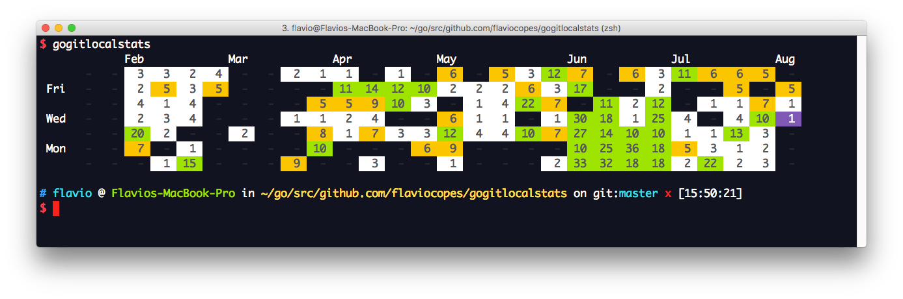
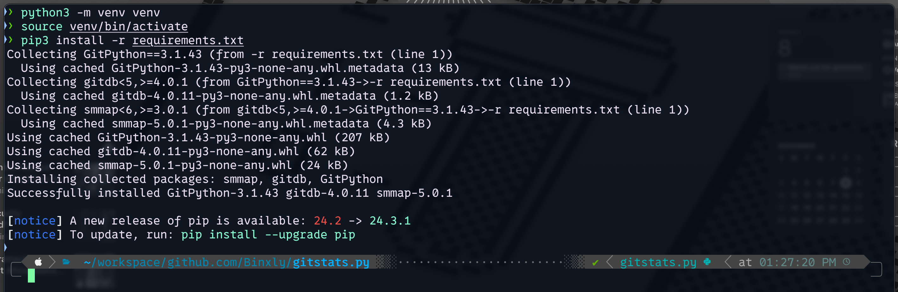
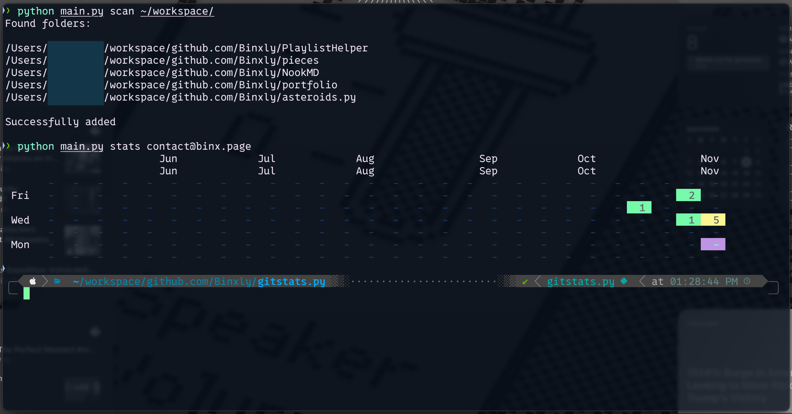

# Acknowledgements

I came across [this Go project](https://flaviocopes.com/go-git-contributions/) from Flavio Copes ([YouTube](https://www.youtube.com/@bootcampdev))
[](https://flaviocopes.com/go-git-contributions/)
The idea was simple: a CLI tool to track *local* git repositories and their contributions.
I wanted to learn more about Go, and figured this would be a fun project to start with.

After many skill issues and some coping, I decided to recreate the core functionality using Python instead. Feel free to use this, steal this, add to this, give this to your friends, your AI agents, whatever. Blog post WIP.
---
The project is split into two stages:

1. **Scanning**: 
   - Recursively scans a directory for Git repositories (skips common dependency folders such as `vendor`, `node_modules`)
   - Stores found repository paths in `~/.pygitlocalstats`

2. **Stats Generation**:
   - Reads the cached repository paths from `~/.pygitlocalstats`
   - Collects commit history for a specified email address (`git config user.email`)
   - Generates a GitHub-style contribution graph for the last 6 months

# Installation 

```bash
git clone https://github.com/Binxly/gitstats.py.git
cd gitstats.py

python -m venv venv
# MacOS/Linux: python3 -m venv venv

pip install -r requirements.txt
# MacOS/Linux: pip3 install -r requirements.txt
```

# Usage

```bash
# Scan for Git repositories
python main.py scan <path>

# Generate and display stats for user email address
python main.py stats <email>
```
